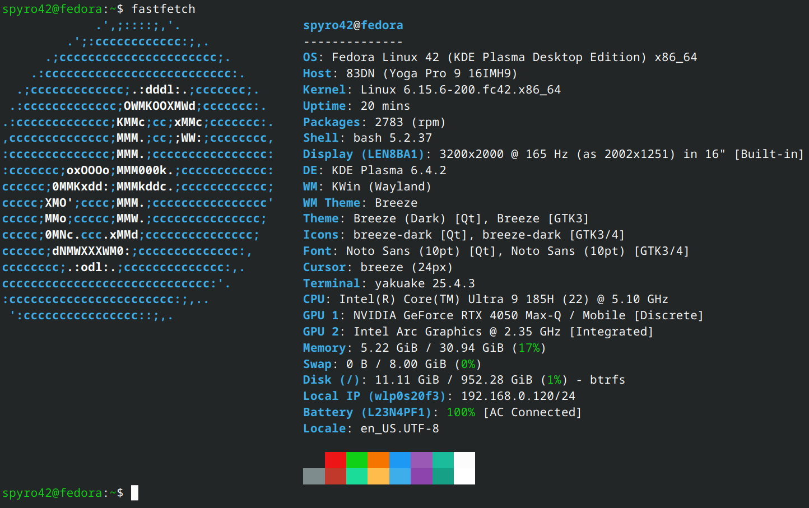

# my_linux_experience
I have had some experiences with installing Linux OSs for a while. Now I want to try to daily drive it &amp; iron out the kinks.

## \# My Build

In `jounals` you can find various issues I have experienced and dealt with.

Hopefully, I can start contributing to some sort of error resolution effort. 

If you know of anything good, send me a message!
